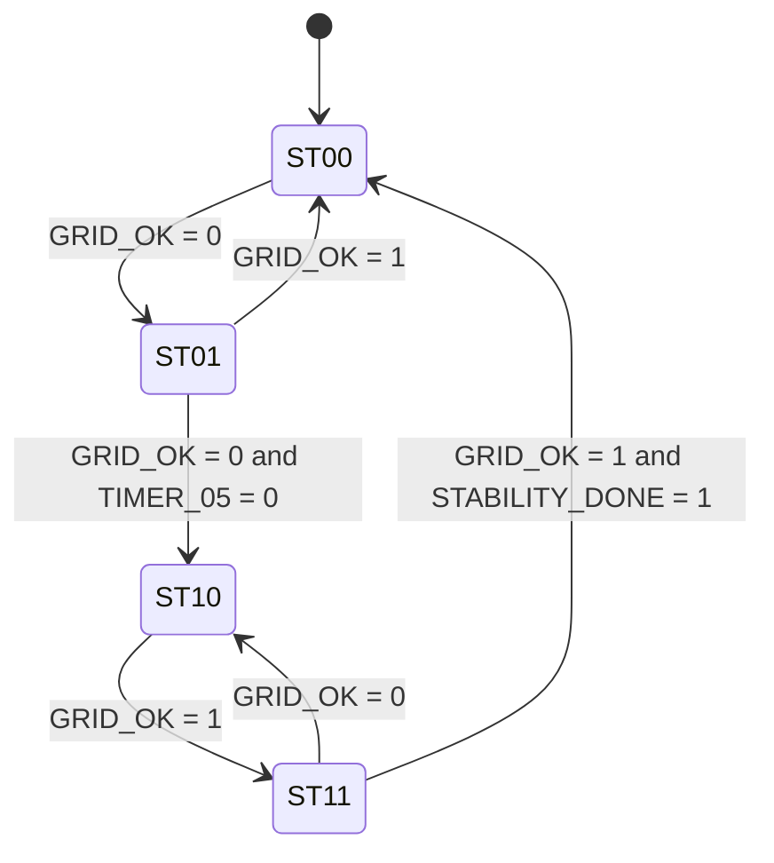

# FSM Design Notes (DACS)

This document explains the DACS finite state machine in equation-level detail.

## FSM purpose

The FSM prevents nuisance source switching by converting instantaneous grid status (`GRID_OK`) into delayed, state-aware switching decisions:

- confirm a **fault** only after 3 consecutive bad cycles,
- confirm a **recovery** only after 5 consecutive good cycles.

At the verification clock (`5 Hz`), those windows are `600 ms` and `1.0 s`.

## FSM implementation view

Implementation is available as a digital circuit and RTL:

- Logisim: `../simulations/logisim/FSM_Grid_Stabilityiteration_FINAL112233.XML (1).circ`
- Verilog: `../simulations/verilog/FSM_Grid_Stability_v2.v`

## State encoding

Let `S1 S0` be the current state bits.

| State | Bits | Meaning |
| --- | --- | --- |
| ST00 | `00` | Grid active, normal operation |
| ST01 | `01` | Grid fault seen, waiting for confirmation |
| ST10 | `10` | Backup mode, grid confirmed bad |
| ST11 | `11` | Grid returned, waiting for stability confirmation |

Decoded state equations:

$$
\begin{aligned}
ST00 &= \overline{S1}\,\overline{S0} \\
ST01 &= \overline{S1}\,S0 \\
ST10 &= S1\,\overline{S0} \\
ST11 &= S1\,S0
\end{aligned}
$$

## Timing base equations

Report verification clock:

$$
T_{clk}=\frac{1}{5}=200\,\text{ms}
$$

Delay windows:

$$
t_{fault}=3\,T_{clk}=600\,\text{ms}, \qquad t_{recovery}=5\,T_{clk}=1.0\,\text{s}
$$

Hardware oscillator formula used in the project:

$$
f=\frac{1.44}{(R_a+2R_b)C}
$$

With `R_a=1k\Omega`, `R_b=150k\Omega`, `C=1\mu F`, this yields about `4.8 Hz` (close to the 5 Hz verification clock).

## Derived internal signals (from implementation)

These are the core helper equations that drive the FSM transitions.

$$
GRID\_FALL = \overline{GRID\_OK}\;\&\;GRID\_delay
$$

$$
STABILITY\_DONE = (QA50\;\&\;QC50)\;|\;(QB50\;\&\;QC50)
$$

$$
TIMER\_05 = \overline{(QA05\;\&\;QB05)}\;\&\;\overline{QC05}
$$

Interpretation:

- `GRID_FALL`: one-cycle pulse on `GRID_OK` falling edge.
- `STABILITY_DONE`: high once recovery counter reaches count 5/6/7.
- `TIMER_05`: high while fault counter is still below the 3-cycle confirmation point.

Counter update equations (from RTL behavior):

$$
cnt50[k+1] =
\begin{cases}
0, & GRID\_OK=0 \\
(cnt50[k]+1) \bmod 8, & GRID\_OK=1
\end{cases}
$$

$$
cnt05[k+1] =
\begin{cases}
0, & GRID\_FALL=1 \\
(cnt05[k]+1) \bmod 6, & GRID\_OK=0\ \text{and}\ GRID\_FALL=0 \\
cnt05[k], & GRID\_OK=1\ \text{and}\ GRID\_FALL=0
\end{cases}
$$

## Next-state Boolean equations

### D0 equation

$$
\begin{aligned}
D0\_T1 &= \overline{S1}\,\overline{S0}\,\overline{GRID\_OK} \\
D0\_T2 &= S1\,\overline{S0}\,GRID\_OK \\
D0\_T3 &= \overline{S1}\,S0\,TIMER\_05\,\overline{GRID\_OK} \\
D0\_T4 &= S1\,S0\,\overline{STAB\_DONE}\,GRID\_OK \\
D0 &= D0\_T1\;|\;D0\_T2\;|\;D0\_T3\;|\;D0\_T4
\end{aligned}
$$

### D1 equation

$$
\begin{aligned}
D1\_T1 &= \overline{S1}\,S0\,\overline{TIMER\_05}\,\overline{GRID\_OK} \\
D1\_T2 &= S1\,\overline{S0} \\
D1\_T3 &= S1\,S0\,\overline{STAB\_DONE} \\
D1 &= D1\_T1\;|\;D1\_T2\;|\;D1\_T3
\end{aligned}
$$

## Equation consequences (operational meaning)

- `D0_T1`: from `ST00`, grid drop pushes machine toward `ST01`.
- `D0_T3`: keeps state in `ST01` while bad grid has not yet reached fault confirmation.
- `D1_T1`: once bad grid persists long enough, drives `ST01 -> ST10`.
- `D0_T2` + `D1_T2`: on grid return in `ST10`, drives `ST10 -> ST11`.
- `D0_T4` + `D1_T3`: keeps machine in `ST11` until recovery confirmation completes.

## Transition summary (practical)

- `ST00 + GRID_OK=0 -> ST01`
- `ST01 + GRID_OK=1 -> ST00`
- `ST01 + GRID_OK=0 + timer expired -> ST10`
- `ST10 + GRID_OK=1 -> ST11`
- `ST11 + GRID_OK=1 + STAB_DONE=1 -> ST00`
- `ST11 + GRID_OK=0 -> ST10`

Here, `STAB_DONE` is the same signal as `STABILITY_DONE`.

## Verification summary

- Extended run: `2779` checks, `0` mismatches.
- State occupancy:
  - `ST00`: 169 cycles (42.5%)
  - `ST01`: 96 cycles (24.1%)
  - `ST10`: 79 cycles (19.9%)
  - `ST11`: 54 cycles (13.6%)
- Transition counts observed:
  - `ST00 -> ST01`: 34
  - `ST01 -> ST00`: 26
  - `ST01 -> ST10`: 8
  - `ST10 -> ST11`: 13
  - `ST11 -> ST00`: 8
  - `ST11 -> ST10`: 5

State occupancy table:

| State | Cycles | Percentage |
| --- | ---: | ---: |
| ST00 | 169 | 42.5% |
| ST01 | 96 | 24.1% |
| ST10 | 79 | 19.9% |
| ST11 | 54 | 13.6% |

## Implementation files

- Verilog RTL: `../simulations/verilog/FSM_Grid_Stability_v2.v`
- Logisim circuit: `../simulations/logisim/FSM_Grid_Stabilityiteration_FINAL112233.XML (1).circ`
