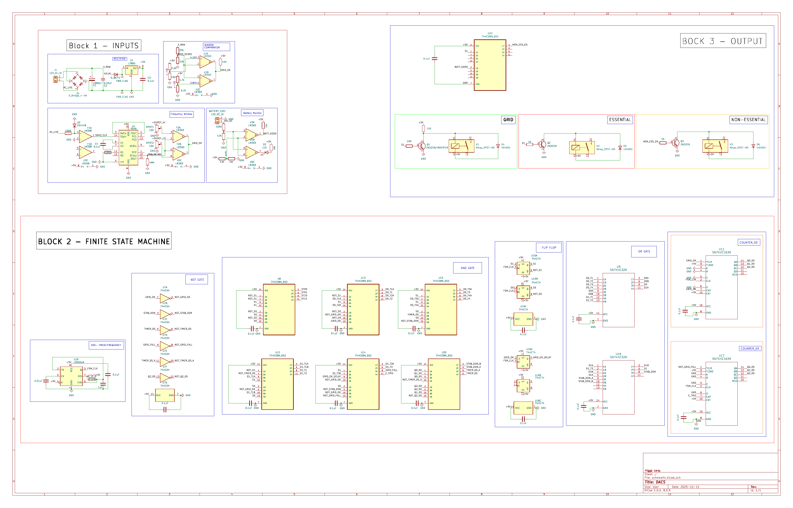
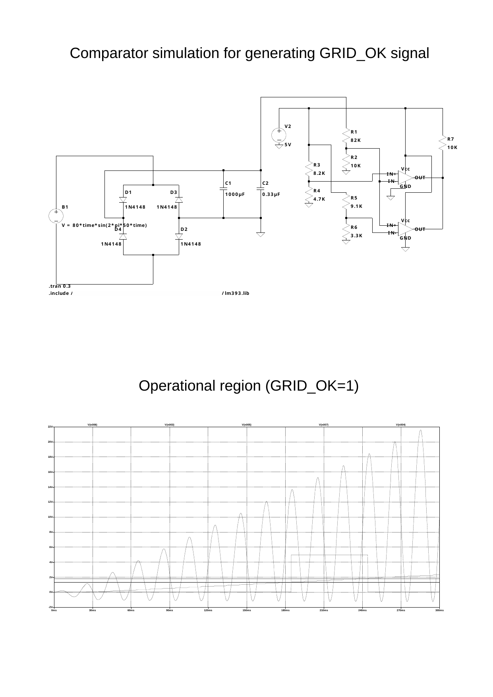
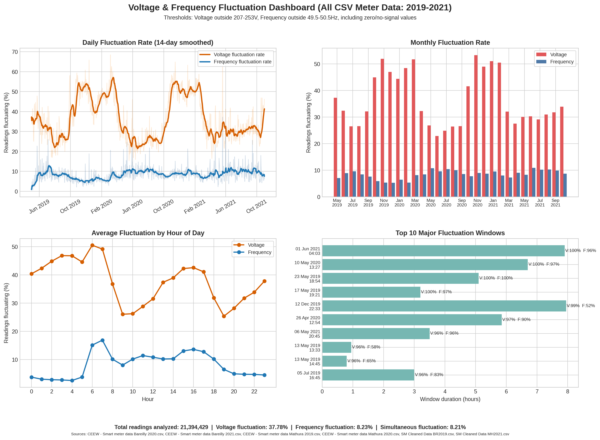
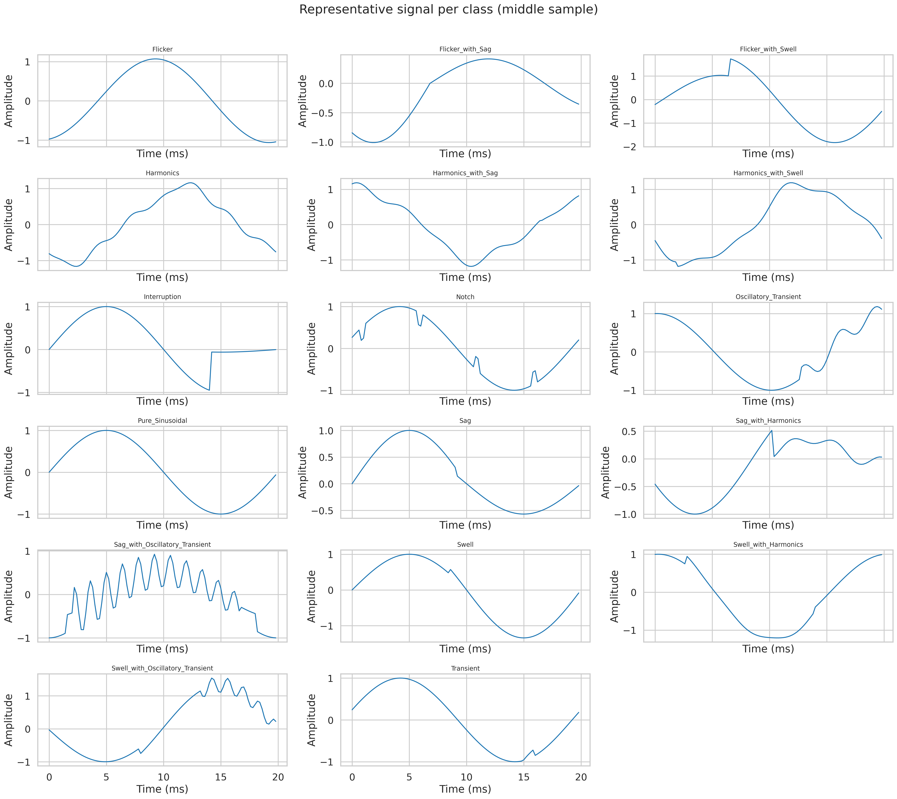

# DACS: Digital Automatic Changeover Switch

DACS is a discrete-logic power changeover controller that monitors grid health and switches loads between mains and inverter/battery supply. It is designed to avoid relay chatter by requiring sustained bad/good conditions before switching.

The full finite state machine (FSM), Boolean equations, and timing behavior are documented in `FSM/README.md`.

## What this project is

- A hardware-first automatic changeover system (no microcontroller in the switching core).
- A three-block architecture: sensing and conditioning, FSM decision logic, and relay output stage.
- A validated FSM implementation in both Logisim and Verilog.
- A delay-justification analysis pipeline for power-quality disturbance datasets.

## Visual overview

### 1) Full hardware architecture (KiCad)

### 2) GRID_OK comparator generation (LTspice)

### 3) Power-quality context plot

### 4) Disturbance class signal examples (delay analysis)

## Repository map

- `hardware/kicad/`: complete KiCad design (`.kicad_sch`, `.kicad_pcb`, exports).
- `grid_ok_generation/`: LTspice comparator model and generated diagram for `GRID_OK` logic.
- `simulations/logisim/`: Logisim-evolution FSM implementation.
- `simulations/verilog/`: synthesizable FSM RTL (`FSM_Grid_Stability_v2.v`).
- `simulations/ltspice/`: LTspice analog simulation files.
- `FSM/`: equation-level FSM documentation.
- `problem_statement/`: source image/script + data citation used in early framing.
- `delay_justification/`: EDA script outputs, plots, and reports for timing-delay defensibility.

## How DACS works (end-to-end)

1. **Input conditioning (Block 1):** rectifies and scales AC sense, checks voltage window and frequency window, and verifies battery level.
2. **Grid health flag generation:** combines voltage + frequency validity into a digital `GRID_OK` signal.
3. **FSM logic (Block 2):** samples `GRID_OK` on `FSM_CLK`, uses state memory + counters to enforce delay windows.
4. **Output drive (Block 3):** relay drivers route power source and shed non-essential load during backup operation.

## Core timing and threshold numbers

- FSM clock is approximately 5 Hz (report uses 5 Hz for verification, i.e. 200 ms/cycle).
- Fault confirmation window: 3 cycles (`~600 ms` at 5 Hz).
- Recovery confirmation window: 5 cycles (`~1.0 s` at 5 Hz).
- Voltage monitor window used in the design documentation is approximately:
  - upper threshold: `~4.08 V`
  - lower threshold: `~2.78 V`

Clock equation used in design notes:

$$
f = \frac{1.44}{(R_a + 2R_b)C}
$$

With `R_a = 1k\Omega`, `R_b = 150k\Omega`, `C = 1\mu F`:

$$
f \approx 4.8\,\text{Hz}, \quad T = \frac{1}{f} \approx 0.21\,\text{s}
$$

## FSM states (high level)

| State | Bits | Meaning |
| --- | --- | --- |
| ST00 | `00` | Grid mode (normal operation) |
| ST01 | `01` | Grid fault detected, waiting for confirmation |
| ST10 | `10` | Backup mode (grid confirmed bad) |
| ST11 | `11` | Grid returned, waiting for stability confirmation |

Transition intent:

- `ST00 -> ST01`: grid falls.
- `ST01 -> ST10`: fault persists until fault timer expires.
- `ST10 -> ST11`: grid returns.
- `ST11 -> ST00`: grid remains healthy until stability timer done.
- Fast rollback paths protect against short disturbances (`ST01 -> ST00`, `ST11 -> ST10`).

For the complete Boolean equations (`GRID_FALL`, `TIMER_05`, `STABILITY_DONE`, `D0`, `D1`, all term-level equations), see `FSM/README.md`.

## Verification artifacts

From the FSM verification campaign artifacts in this repository:

- 2779 automated checks reported, 0 mismatches.
- State occupancy observed:
  - ST00: 169 cycles (42.5%)
  - ST01: 96 cycles (24.1%)
  - ST10: 79 cycles (19.9%)
  - ST11: 54 cycles (13.6%)

Detailed state equations and transition logic are documented in `FSM/README.md`.

## Delay-justification EDA (dataset side)

The `delay_justification/` folder contains a full analysis pipeline for disturbance classes (17 classes, one-cycle signals at 5 kHz sampling). It supports the claim that non-zero observation windows are required before robust disturbance discrimination.

Useful plots include:

- `delay_justification/eda_outputs/plots/representative_signals_per_class.png`
- `delay_justification/eda_outputs/plots/overlay_transient_related_classes.png`
- `delay_justification/eda_outputs/plots/scatter_transient_vs_sagswell_derivative_vs_spectralspread.png`

## Main source files

- Verilog FSM: `simulations/verilog/FSM_Grid_Stability_v2.v`
- Logisim FSM: `simulations/logisim/FSM_Grid_Stabilityiteration_FINAL112233.XML (1).circ`
- Comparator LTspice: `grid_ok_generation/comparator_grid_ok.asc`
- Hardware schematic source: `hardware/kicad/schematic.kicad_sch`

## References and citations

- FSM implementation references: `simulations/verilog/FSM_Grid_Stability_v2.v`, `simulations/logisim/FSM_Grid_Stabilityiteration_FINAL112233.XML (1).circ`
- Smart-meter citation used in problem framing: `problem_statement/citations.txt`
- Comparator SPICE model source note: `grid_ok_generation/resources.txt`

## License

MIT. See `LICENSE`.
